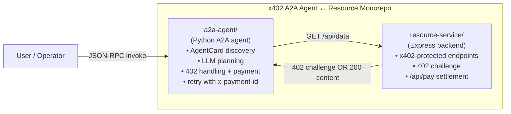
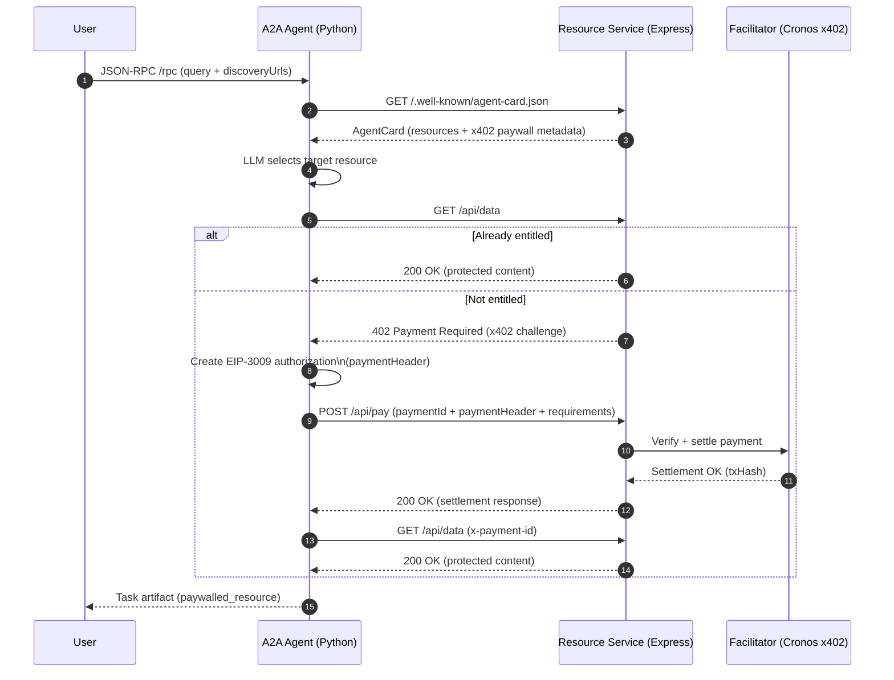

# X402 A2A Agent to Resource Monorepo

This repository contains a complete **end-to-end example** of using the **x402 payment protocol** to protect HTTP resources and consume them from an **autonomous A2A agent**.

It includes:

- A **Resource Service** (backend) that exposes x402-protected endpoints
- An **A2A Agent** (client) that discovers resources, handles `402 Payment Required`, settles payments, and retries requests automatically

Together, these projects demonstrate the **full client ↔ merchant flow** for x402-based paywalls using **agent-to-agent interaction** instead of a browser-based frontend.

## Repository Structure

```
.
├── resource-service/   # x402-protected backend (Express)
├── a2a-agent/          # x402-enabled consumer agent (Python, A2A)
└── README.md           # Monorepo documentation (this file)
```

Each package has its **own README** with detailed setup and implementation notes.

## Overview

The flow implemented in this monorepo is:

1. The **A2A agent** requests a protected backend endpoint.
2. The backend responds with **402 Payment Required** and an x402 challenge.
3. The agent parses the challenge and generates an **EIP-3009 authorization**.
4. The agent submits the signed authorization to the backend.
5. The backend verifies and settles the payment via the facilitator.
6. The agent retries the original request using `x-payment-id`.
7. The backend returns the protected resource to the agent.

This setup is intended for **local development, demos, and reference implementations** of x402-enabled agent consumers.

## Diagrams

### Monorepo at a glance (structure + roles)



### End-to-end sequence (the full payment flow)



## Prerequisites

Before running the monorepo locally, ensure you have:

- **Node.js v20+**
- **Python 3.10+**
- **npm** or **yarn**
- An **EVM-compatible private key**
- Test funds on **Cronos Testnet**
- A local or public **Cronos RPC endpoint**
- An **OpenAI API key** (for agent planning)

## Running the Full Stack Locally

### 1. Clone the Repository

```bash
git clone https://github.com/cronos-labs/x402-examples.git
cd x402-examples/a2a
```

### 2. Start the Backend (Resource Service)

```bash
cd resource-service
npm install
cp .env.example .env
```

Update `.env` with your merchant configuration:

```bash
NODE_ENV=development
PORT=8787
NETWORK=cronos-testnet
MERCHANT_ADDRESS=0xYOUR_MERCHANT_ADDRESS
PRICE_BASE_UNITS=1000000
PUBLIC_RESOURCE_URL=http://localhost:8787/api/data
```

Run the service:

```bash
npm run dev
```

The backend will be available at:

```
http://localhost:8787
```

### 3. Start the Client (A2A Agent)

In a new terminal:

```bash
cd a2a-agent
pip install -e .
cp .env.example .env
```

Configure the agent:

```bash
OPENAI_API_KEY=sk-...
X402_PRIVATE_KEY=0xYOUR_PRIVATE_KEY
A2A_AGENT_PORT=9001
```

Run the agent:

```bash
python -m agent.main
```

The agent will be available at:

```
http://localhost:9001
```

## End-to-End Flow

Once both services are running:

1. The **A2A agent** is invoked via its `/rpc` endpoint.
2. The agent discovers the **Resource Service**.
3. The agent attempts to fetch a protected resource.
4. The backend returns `402 Payment Required`.
5. The agent generates and submits an **EIP-3009 authorization**.
6. The backend settles the payment.
7. The agent retries the request.
8. The protected content is returned as a task artifact.

No browser, wallet UI, or frontend interaction is required.

## Package-Specific Documentation

For implementation details, refer to the individual READMEs:

- **A2A Agent (Client)** → [`a2a-agent/README.md`](./a2a-agent/README.md)
- **Resource Service (Backend)** → [`resource-service/README.md`](./resource-service/README.md)

## Notes & Limitations

- Entitlements are stored **in memory** on the backend (no persistence).

- This repository is **not production-ready**.

- The API contract assumes:

  - `GET /api/data`
  - `POST /api/pay`
  - `paymentId` returned in the x402 challenge

- The A2A agent currently assumes:

  - `exact` payment scheme
  - Cronos Testnet defaults
  - Single-payment-per-resource flow

Below is a **drop-in README section** you can add verbatim to your monorepo documentation.

---

## Example: Invoking the A2A Agent via `curl`

You can interact with the **A2A agent** directly using a streaming JSON-RPC request. This example shows how to ask the agent to discover a resource service, handle an x402 paywall, and return the protected content — all from the command line.

### Example Request

```bash
curl -N http://localhost:9001/rpc \
  -H "Content-Type: application/json" \
  -d '{
    "jsonrpc": "2.0",
    "id": "1",
    "method": "message/stream",
    "params": {
      "message": {
        "kind": "message",
        "message_id": "msg-1",
        "role": "user",
        "parts": [
          {
            "kind": "text",
            "text": "{\"discoveryUrls\":[\"http://localhost:8787\"],\"query\":\"get me the paywalled resource\"}"
          }
        ]
      }
    }
  }'
```

### What This Does

- Sends a **streaming JSON-RPC** request to the A2A agent
- Provides:

  - `discoveryUrls`: where the agent should look for resources
  - `query`: a natural-language instruction for the agent

- Triggers the full flow:

  1. Agent discovery (`/.well-known/agent-card.json`)
  2. Resource selection
  3. Initial request → `402 Payment Required`
  4. Automatic x402 payment (EIP-3009)
  5. Retry with `x-payment-id`
  6. Retrieval of the protected resource

### Example Streaming Output (Truncated)

During execution, the agent streams incremental status updates:

```text
data: Planning paywall request: get me the paywalled resource
data: Discovering agents: ['http://localhost:8787']
data: Selected: paywall-resource (http://localhost:8787)
data: Fetching resource (may trigger 402)
```

Once payment is settled, the agent emits a task artifact containing the protected content:

```json
{
  "artifactId": "a308ece8-12a9-49ec-93ce-acec05600591",
  "name": "paywalled_resource",
  "parts": [
    {
      "kind": "text",
      "text": "paid=True paymentId=pay_1dd55129-edaa-43df-bbb8-6d9d51eefe7f\n\n{'ok': True, 'response': 'paid content unlocked'}"
    }
  ]
}
```

### Notes

- Use `-N` with `curl` to **disable buffering** and see streamed responses in real time.
- No browser, wallet UI, or frontend is involved.
- The agent autonomously handles:

  - `402 Payment Required`
  - Payment authorization
  - Settlement
  - Retry logic

## Technologies Used

- **Python**
- **Node.js**
- **Express**
- **A2A Agent SDK**
- **@crypto.com/facilitator-client**
- **x402 protocol**
- **EIP-3009 (Exact Scheme)**
- **httpx**
- **OpenAI API**

## License

This project is licensed under the **MIT License**.
