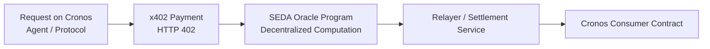

# x402-oracle

### Programmable Oracle Primitive for Cronos

**Created by www.fiui.org.ar**

Enabling **Execution-Grade Data** and **Agentic Finance** on Cronos.

---

## 1. Architecture Overview

### Settlement, Computation, and Monetization

This project redefines the role of oracles in the Cronos DeFi ecosystem through a **three-layer architecture** that cleanly separates capital settlement, decentralized computation, and economic incentives.

### Settlement Layer - Cronos

Cronos is the gravity center where capital lives and moves. All DeFi execution (VVS swaps, liquidity provision, lending, and downstream smart-contract actions) occurs on Cronos.
Cronos also serves as the final settlement layer for oracle outputs and per-request payments.
For this MVP, Cronos consumes oracle results via a relayer-trusted settlement contract, optimized for gas efficiency and clarity. This design intentionally avoids heavy verification logic on the EVM while preserving public auditability.

### Computation Layer - SEDA (Core)

SEDA provides decentralized, chain-agnostic computation that transforms raw on-chain data into execution-grade metrics.

In this MVP, the system uses SEDA Core, prioritizing correctness, determinism, and consensus finality over raw latency. Oracle programs execute fully decentralized logic and produce signed, consensus-finalized results that are publicly verifiable via the SEDA Explorer.

**Note**

In a production deployment, this architecture can migrate to SEDA Fast, significantly reducing end-to-end latency while preserving the same programmable oracle interface and execution semantics.
This separation ensures that Cronos remains focused on settlement, while SEDA handles all heavy computation and validation.

### Monetization Layer - x402

x402 introduces a pay-per-request model using the HTTP 402 standard.
It converts oracle access into an explicit economic transaction settled on-chain, enabling:

- Sustainable oracle revenue driven by real usage
- Fine-grained pricing for different levels of data richness
- Native compatibility with autonomous agents and AI systems

This eliminates reliance on protocol-level oracle subsidies and aligns incentives from day one.

## 2. The Problem: From Price Feeds to Execution-Grade Metrics

Traditional oracles deliver spot prices or simple TWAPs. These signals lack context, are vulnerable to manipulation, and are insufficient for autonomous execution - especially in environments exposed to flash loans and shallow liquidity.

Autonomous agents and DeFi protocols do not need raw prices.
They need decisions.

This MVP is intentionally designed as a reference implementation: it demonstrates the potential and flexibility of a programmable oracle framework, not a one-size-fits-all feed.

At its core, x402-oracle is an Oracle-as-a-Service, where each agent, vault, or protocol can define its own execution logic, risk model, and output schema, tailored to its specific strategy and constraints.

### Customizable, Programmable Fair Value

Instead of publishing a universal price, the oracle computes a context-aware fair value using programmable logic inspired by established asset-pricing research.

- The valuation model is customizable per pool, per vault, or per agent
- Risk assumptions and weighting can differ across use cases
- All logic is executed deterministically and finalized by SEDA consensus

This allows different consumers to ask fundamentally different questions of the same underlying data.

### Actionable Pool Health Metrics (Execution-Ready)

Rather than returning a single scalar, the oracle emits a compact, multidimensional payload explicitly designed for execution:

```json
{
  "fair_price": 1.0234,
  "confidence_score": 0.98,
  "max_safe_execution_size": 150000,
  "flags": 0
}
```

Each field has a clear execution meaning:

- `fair_price` - reference value for pricing or collateralization
- `confidence_score` - reliability of the signal under current conditions
- `max_safe_execution_size` - capital sizing constraint derived from liquidity and slippage
- `flags` - machine-readable risk conditions

From data feeds to decision interfaces, this structure allows smart contracts and AI agents to answer:

- Is execution safe right now?
- How much capital can be deployed without destabilizing the pool?
- Should execution be delayed, reduced, or aborted?

This MVP showcases one concrete configuration, but the architecture is designed to support many bespoke oracle programs, each serving a different agent, vault, or protocol with execution-grade intelligence.

## 3. Oracle-as-a-Service: Seamless Delivery and Composability



## 4. Strategic Vision: Enabling Agentic Finance on Cronos

This project is not merely an oracle feed.

It is an enabling primitive for Agentic Finance on Cronos.

By creating a marketplace for paid, verifiable, execution-grade DeFi intelligence, the system enables:

- Sustainability - oracle revenue driven by real demand, not subsidies
- Security - reduced systemic risk when accepting LP tokens as collateral
- Autonomy - AI agents that operate safely and profitably, paying only for the intelligence required to move capital

## Output Format (Canonical)

On-chain output is a fixed `int256[4]` array with **1e6 scale**:

```
values[0] = fair_price (1e6)
values[1] = confidence_score (1e6)
values[2] = max_safe_execution_size (1e6)
values[3] = flags (bitmask)
```

## Output Formulas (WCRO-USDC)

Pool (VVS V2): `0xE61Db569E231B3f5530168Aa2C9D50246525b6d6`

Let `reserveUSDC` and `reserveWCRO` be normalized reserves (USDC 6 decimals, WCRO 18 decimals).

### Spot and Historical Price

```
spot_1e6 = (reserveUSDC_now * 1e18) / reserveWCRO_now
hist_1e6 = (reserveUSDC_hist * 1e18) / reserveWCRO_hist
```

### Fair Price (Weighted)

```
fair_price_1e6 = (2 * spot_1e6 + hist_1e6) / 3
```

### Liquidity Score (1e6)

```
liquidity_usdc = reserveUSDC_now * 2
L = 500_000 * 1e6
liq_score_1e6 = min(1e6, (liquidity_usdc * 1e6) / L)
```

### Temporal Score (1e6)

```
delta_1e6 = (abs(spot_1e6 - hist_1e6) * 1e6) / spot_1e6
time_score_1e6 = clamp(1e6 - (delta_1e6 * 1e6) / 50_000, 0, 1e6)
```

### Confidence Score (60 / 40)

```
confidence_1e6 =
  (600_000 * liq_score_1e6 + 400_000 * time_score_1e6) / 1_000_000
```

### Max Safe Execution Size (1e6, USDC input)

Using AMM V2 pricing:

```
amountOut =
  (amountIn * 997 * reserveOut) /
  (reserveIn * 1000 + amountIn * 997)

effective_price_1e6 =
  (amountIn * 1e18) / amountOut

slippage_1e6 =
  (abs(effective_price_1e6 - spot_1e6) * 1e6) / spot_1e6
```

The maximum `amountIn` is found via bisection such that:

```
slippage_1e6 < 10_000   // 1%
```

## Flags (values[3])

- `bit0 (0x1)` - CRITICAL_DIVERGENCE if `delta_1e6 > 50_000` (5%)
- `bit1 (0x2)` - LOW_LIQUIDITY if `liq_score_1e6 < 200_000`
- `bit2 (0x4)` - UNSAFE_CONFIDENCE if `confidence_1e6 < 200_000`

## Validation Checklist (Testnet)

- Oracle Program ID (SEDA Core): `0x61d26d8e7693b39a4296e1ecba45595bc7cdbbeecb1043c7034c8f99498f1504`
- Data Request ID (SEDA): `ba65b51684c798468ef9282cf245d96d45942beeec73a0b73c5c607ca768ed15`
- SEDA Explorer: `https://testnet.explorer.seda.xyz/data-requests/ba65b51684c798468ef9282cf245d96d45942beeec73a0b73c5c607ca768ed15/7299903`
- Cronos Consumer Contract: `0xe0F946B25e4cce13FeF052cc76573fA8dF74D9D9`
- Relayer Transaction (Cronos testnet): `0x383aaf3d2ac7b36a4702fd62cd63db74405713fe9991a501b6b934c965748576`
- Cronos Explorer: `https://testnet.cronoscan.com/tx/0x383aaf3d2ac7b36a4702fd62cd63db74405713fe9991a501b6b934c965748576`

Observed values (1e6 scale):

- `values[0] = 102308` -> `0.102308` (fair_price)
- `values[1] = 943288` -> `0.943288` (confidence_score)
- `values[2] = 26581068577` -> `26581.068577` (max_safe_execution_size)
- `values[3] = 0` (flags)

## License

This project is released under the MIT License.
