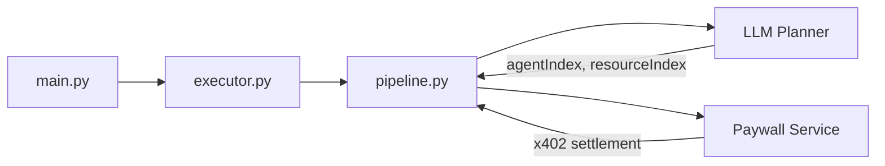

# A2A Agent

The **A2A Agent** is an A2A-based autonomous agent that discovers, negotiates, and accesses **x402-protected resources** across an agent network.
It acts as a **payment-capable client agent**, automatically handling **HTTP 402 challenges**, settling payments via the **Cronos X402 Facilitator**, and retrying requests to retrieve protected content.

The agent integrates:

- **A2A AgentCards** for discovery
- **LLM-driven planning** for target selection
- **EIP-3009 (exact scheme)** for off-chain payment authorization

## Table of Contents

- [Overview](#overview)
- [Features](#features)
- [Setup and Installation](#setup-and-installation)
- [Environment Variables](#environment-variables)
- [API Endpoints](#api-endpoints)

  - [Agent Card](#agent-card)
  - [RPC Endpoint](#rpc-endpoint)

- [Architecture Overview](#architecture-overview)
- [Example Usage](#example-usage)

  - [Discover and Fetch Paywalled Resource](#discover-and-fetch-paywalled-resource)

- [Technologies Used](#technologies-used)
- [License](#license)

## Overview

The **Paywall Agent Service** showcases how an autonomous agent can **consume x402-protected resources** without hard-coded endpoints or manual payment handling.

When the agent is invoked:

1. It discovers other agents via `.well-known/agent-card.json`.
2. It inspects advertised resources and identifies x402-protected endpoints.
3. An **LLM planner** selects the best agent + resource for the user query.
4. The agent attempts to access the resource.
5. If a **402 Payment Required** challenge is returned:

   - A signed payment header is generated (EIP-3009).
   - Payment is settled via the X402 Facilitator.
   - The request is retried with `x-payment-id`.

6. The protected content is returned as a final artifact.

This service is intended for **local development, demos, and reference implementations** of x402-enabled agent consumers.

## Diagrams

### A2A Agent internal architecture



## Features

**x402-Aware Client Agent** — Automatically handles 402 challenges and settlement.
**AgentCard Discovery** — Finds providers dynamically via A2A well-known endpoints.
**LLM-Based Planning** — Selects the best agent/resource using an OpenAI model.
**Exact Scheme Support** — Uses EIP-3009 (`transferWithAuthorization`).
**Cronos Network Support** — Cronos Testnet by default (configurable).
**Event-Driven Execution** — Emits structured progress, failure, and result events.

---

## Setup and Installation

### Prerequisites

- Python **3.10+**
- `pip`
- An **OpenAI API key**
- A **Cronos-compatible private key** for x402 payments
- Access to one or more **x402-enabled resource agents**

### Installation Steps

1. **Clone the Repository**

   ```bash
   git clone https://github.com/cronos-labs/x402-examples/a2a/a2a-agent
   cd a2a-agent
   ```

2. **Install Dependencies**

   ```bash
   pip install -e .
   ```

3. **Create Environment Variables**

   ```bash
   cp .env.example .env
   ```

4. **Example `.env` file**

   ```bash
   # OpenAI
   OPENAI_API_KEY=sk-...
   LLM_MODEL=gpt-4o-mini

   # X402
   X402_PRIVATE_KEY=0xYOUR_PRIVATE_KEY

   # Server
   A2A_AGENT_PORT=9001
   ```

5. **Run the Agent**

   ```bash
   python -m host.main
   ```

## Environment Variables

| Variable           | Description                                | Required |
| ------------------ | ------------------------------------------ | -------- |
| `OPENAI_API_KEY`   | OpenAI API key used for planning           | yes      |
| `LLM_MODEL`        | LLM model name                             | no       |
| `X402_PRIVATE_KEY` | Private key used to sign EIP-3009 payments | yes      |
| `A2A_AGENT_PORT`   | HTTP port for the agent server             | no       |

## API Endpoints

### Agent Card

**GET** `/.well-known/agent-card.json`

Publishes the agent’s identity, capabilities, and supported skills for discovery by other agents.

**Example Response**

```json
{
  "name": "paywall-agent",
  "description": "Discovers X402 paywalled resources and pays to access them.",
  "url": "http://localhost:9001",
  "version": "1.0.0"
}
```

### RPC Endpoint

**POST** `/rpc`

Primary A2A JSON-RPC endpoint used to invoke the agent.

## Architecture Overview

```
agent/
├── main.py            # Server entry point
├── executor.py        # A2A task executor
├── pipeline.py        # Orchestration flow
└── service.py         # Discovery + x402 settlement logic

lib/
├── a2a/               # Discovery + event helpers
├── openai/            # LLM client + planner
├── enums/             # Status, progress, artifact enums
├── errors/            # Structured error types
└── config.py          # Centralized configuration
```

## Example Usage

### Discover and Fetch Paywalled Resource

Invoke the agent with a discovery URL and a natural-language query:

```bash
curl -X POST http://localhost:9001/rpc \
  -H "Content-Type: application/json" \
  -d '{
    "jsonrpc": "2.0",
    "method": "message/send",
    "params": {
      "message": {
        "content": {
          "discoveryUrls": ["http://localhost:8787"],
          "query": "get paywalled resource"
        }
      }
    },
    "id": 1
  }'
```

**Behavior**

- The agent discovers resource providers
- Handles `402 Payment Required`
- Settles payment
- Retries request
- Emits final artifact containing protected content

## Technologies Used

- **Python 3.10+**
- **A2A Agent SDK (Starlette-based)**
- **x402 protocol**
- **Cronos X402 Facilitator**
- **EIP-3009 (Exact Scheme)**
- **OpenAI API**
- **httpx**
- **python-dotenv**

## License

This project is licensed under the **MIT License**.
